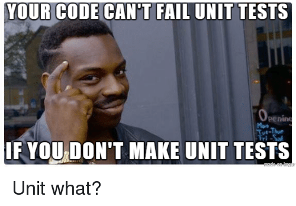

As you all have seen I have been working on a school project revolving slices containing slices in golang. In other words doing a bunch of calculations and modifications on items stored in a matrix.

## Old fashion prints

This is something i've tested using print statements but once you have written function after function and never really tested them more than with prints. You come to think about the possibility that you made a small error while checking the prints.

## Realization

While demonstrating the functionality of my written code to my project teammates i realized that I never really checked if the stored struct in the board matrix actually kept all the neighbors of it's own position.

It's been a dumb way to code this project without doing test cases and having a set system-architecture of the planned system in some sort of visual form. So from this time on, I will do my best to structure any upcoming projects in that manner!

Feel it's a realization coming way to late.
but hey, better late than never!

